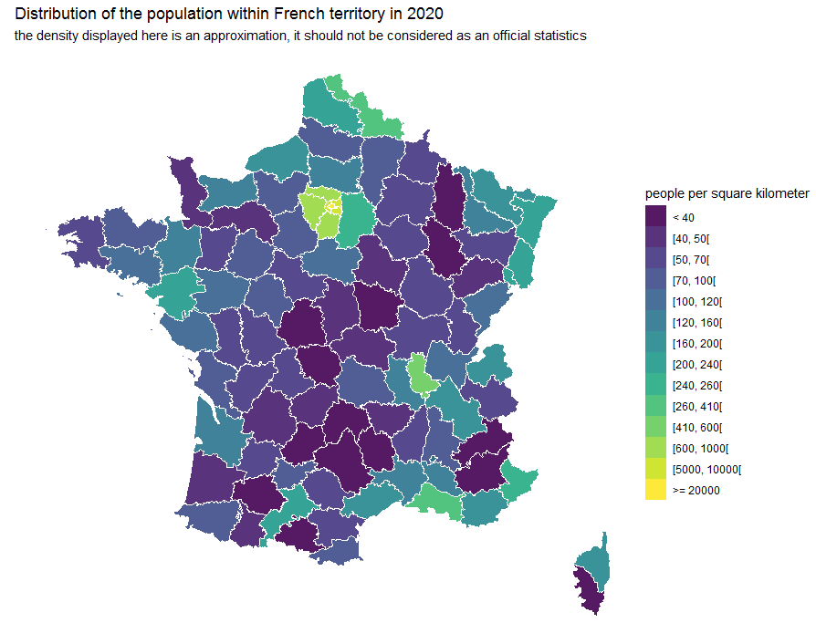

insee R package
================

<br> 
[](https://cran.r-project.org/package=insee) 
[](https://cran.r-project.org/web/checks/check_results_insee.html) 
[](https://codecov.io/gh/hadrilec/insee?branch=master) 
[](https://www.tidyverse.org/lifecycle/#maturing) 
[](https://cran.r-project.org/package=insee) 
[](https://cran.r-project.org/package=insee)
[](https://www.repostatus.org/) 
[](https://travis-ci.org/hadrilec/insee) 
[](https://github.com/hadrilec/insee/actions) 
<br> 

Overview
--------

The insee package contains tools to easily download data and metadata from INSEE main database (BDM).

Using embedded SDMX queries, get the data of more than 150 000 INSEE series.

Have a look at the detailed SDMX web service page with the following [link](https://www.insee.fr/en/information/2868055).

This package is a contribution to reproducible research and public data transparency.

Installation & Loading
----------------------

``` r
# Get the development version from GitHub
# install.packages("devtools")
# devtools::install_github("hadrilec/insee")

# Get the CRAN version
install.packages("insee")

# examples below use tidyverse packages 
library(tidyverse)
library(insee)
```

Examples & Tutorial
-------------------

-   [Tutorial](https://hadrilec.github.io/insee/articles/insee.html)
-   [GDP](https://hadrilec.github.io/insee/articles/v2_gdp-vignettes.html)
-   [Inflation](https://hadrilec.github.io/insee/articles/v3_inflation-vignettes.html)
-   [Unemployment rate](https://hadrilec.github.io/insee/articles/v4_unem-vignettes.html)
-   [Population by age](https://hadrilec.github.io/insee/articles/v5_pop-vignettes.html)
-   [Population map](https://hadrilec.github.io/insee/articles/v6_pop_map-vignettes.html)

French GDP growth rate
----------------------


``` r
library(tidyverse)
library(insee)

df_idbank_list_selected =
  get_idbank_list("CNT-2014-PIB-EQB-RF") %>% # Gross domestic product balance
  filter(FREQ == "T") %>% #quarter
  add_insee_title() %>% #add titles
  filter(OPERATION == "PIB") %>% #GDP
  filter(NATURE == "TAUX") %>% #rate
  filter(CORRECTION == "CVS-CJO") #SA-WDA, seasonally adjusted, working day adjusted

idbank = df_idbank_list_selected %>% pull(idbank)

data = 
  get_insee_idbank(idbank) %>% 
  add_insee_metadata()

ggplot(data, aes(x = DATE, y = OBS_VALUE)) +
  geom_col() +
  ggtitle("French GDP growth rate, quarter-on-quarter, sa-wda") +
  labs(subtitle = sprintf("Last updated : %s", data$TIME_PERIOD[1]))
```

Population Map
--------------



``` r
library(insee)
library(tidyverse)

library(raster)
library(rgdal)
library(geosphere)
library(broom)
library(viridis)

dataset_list = get_dataset_list()

list_idbank = 
  get_idbank_list("TCRED-ESTIMATIONS-POPULATION") %>%
  filter(AGE == "00-") %>% #all ages
  filter(SEXE == 0) %>% #men and women
  filter(str_detect(REF_AREA, "^D")) %>% #select only departements
  add_insee_title()

list_idbank_selected = list_idbank %>% pull(idbank)

# get population data by departement
pop = get_insee_idbank(list_idbank_selected) 

#get departements' geographical limits
FranceMap <- raster::getData(name = "GADM", country = "FRA", level = 2)

# extract the population by departement in 2020
pop_plot = pop %>%
  group_by(TITLE_EN) %>%
  filter(DATE == "2020-01-01") %>%
  mutate(dptm = gsub("D", "", REF_AREA)) %>%
  filter(dptm %in% FranceMap@data$CC_2) %>%
  mutate(dptm = factor(dptm, levels = FranceMap@data$CC_2)) %>%
  arrange(dptm) %>%
  mutate(id = dptm)

vec_pop = pop_plot %>% pull(OBS_VALUE)

# add population data to the departement object map
FranceMap@data$pop = vec_pop

get_area = function(long, lat){
  area = areaPolygon(data.frame(long = long, lat = lat)) / 1000000
  return(data.frame(area = area))
}

# extract the departements' limits from the spatial object and compute the surface
FranceMap_tidy_area <- 
  broom::tidy(FranceMap) %>% 
  group_by(id) %>%
  group_modify(~get_area(long = .x$long, lat = .x$lat))

FranceMap_tidy <- 
  broom::tidy(FranceMap) %>% 
  left_join(FranceMap_tidy_area)

# mapping table
dptm_df = data.frame(dptm = FranceMap@data$CC_2,
                     dptm_name = FranceMap@data$NAME_2,
                     pop = FranceMap@data$pop,
                     id = rownames(FranceMap@data))

FranceMap_tidy_final_all =
  FranceMap_tidy %>%
  left_join(dptm_df, by = "id") %>%
  mutate(pop_density = pop/area) %>% 
  mutate(density_range = case_when(pop_density < 40 ~ "< 40",
                                   pop_density >= 40 & pop_density < 50 ~ "[40, 50]",
                                   pop_density >= 50 & pop_density < 70 ~ "[50, 70]",
                                   pop_density >= 70 & pop_density < 100 ~ "[70, 100]",
                                   pop_density >= 100 & pop_density < 120 ~ "[100, 120]",
                                   pop_density >= 120 & pop_density < 160 ~ "[120, 160]",
                                   pop_density >= 160 & pop_density < 200 ~ "[160, 200]",
                                   pop_density >= 200 & pop_density < 240 ~ "[200, 240]",
                                   pop_density >= 240 & pop_density < 260 ~ "[240, 260]",
                                   pop_density >= 260 & pop_density < 410 ~ "[260, 410]",
                                   pop_density >= 410 & pop_density < 600 ~ "[410, 600]",
                                   pop_density >= 600 & pop_density < 1000 ~ "[600, 1000]",
                                   pop_density >= 5000 & pop_density < 10000 ~ "[5000, 10000]",
                                   pop_density >= 20000 ~ ">= 20000"
  )) %>% 
  mutate(`people per square kilometer` = factor(density_range,
                                levels = c("< 40","[40, 50]", "[50, 70]","[70, 100]",
                                           "[100, 120]", "[120, 160]", "[160, 200]",
                                           "[200, 240]", "[240, 260]", "[260, 410]",
                                           "[410, 600]",  "[600, 1000]",
                                           "[5000, 10000]", ">= 20000")))

ggplot(data = FranceMap_tidy_final_all,
               aes(fill = `people per square kilometer`, x = long, y = lat, group = group) ,
               size = 0, alpha = 0.9) +
  geom_polygon() +
  geom_path(colour = "white") +
  coord_map() +
  theme_void() +
  scale_fill_viridis(discrete = T) + 
  ggtitle("Distribution of the population within French territory in 2020") +
  labs(subtitle = "the density displayed here is an approximation, it should not be considered as an official statistics")
  
  
```

How to avoid proxy issues ?
---------------------------

``` r
Sys.setenv(http_proxy = "my_proxy_server")
Sys.setenv(https_proxy = "my_proxy_server")
```

Support
-------

Feel free to contact me with any question about this package using this [e-mail address](mailto:hadrien.leclerc@insee.fr?subject=%5Br-package%5D%5Binsee%5D).
