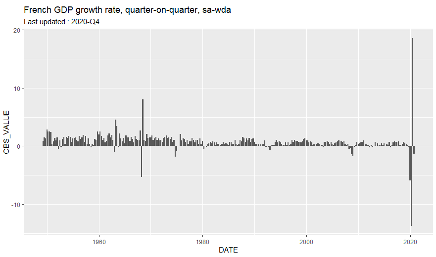

insee R package
================

<br>

[](https://cran.r-project.org/package=insee)
[](https://cran.r-project.org/web/checks/check_results_insee.html)
[](https://codecov.io/gh/hadrilec/insee?branch=master)
[](https://www.tidyverse.org/lifecycle/#maturing)
[](https://cran.r-project.org/package=insee)
[](https://cran.r-project.org/package=insee)
[](https://www.repostatus.org/)
[](https://travis-ci.org/hadrilec/insee)
[](https://github.com/hadrilec/insee/actions)

<br>

## Overview

The insee package contains tools to easily download data and metadata
from INSEE main database (BDM).

Using embedded SDMX queries, get the data of more than 150 000 INSEE
series.

Have a look at the detailed SDMX web service page with the following
[link](https://www.insee.fr/en/information/2868055).

This package is a contribution to reproducible research and public data
transparency.

## Installation & Loading

``` r
# Get the development version from GitHub
# install.packages("devtools")
# devtools::install_github("hadrilec/insee")

# Get the CRAN version
install.packages("insee")

# examples below use tidyverse packages 
library(tidyverse)
library(insee)
```

## French GDP growth rate



``` r
library(tidyverse)
library(insee)

idbank_list = get_idbank_list()

df_idbank_list_selected =
  idbank_list %>%
  filter(nomflow == "CNT-2014-PIB-EQB-RF") %>% # Gross domestic product balance
  filter(dim1 == "T") %>% #quarter
  add_insee_title() %>% #add titles
  filter(dim4 == "PIB") %>% #GDP
  filter(dim6 == "TAUX") %>% #rate
  filter(dim10 == "CVS-CJO") #SA-WDA, seasonally adjusted, working day adjusted

idbank = df_idbank_list_selected %>% pull(idbank)

data = get_insee_idbank(idbank)

ggplot(data, aes(x = DATE, y = OBS_VALUE)) +
  geom_col() +
  ggtitle("French GDP growth rate, quarter-on-quarter, sa-wda") +
  labs(subtitle = sprintf("Last updated : %s", data$TIME_PERIOD[1]))
```

## Examples & Tutorial

  - [Tutorial](https://hadrilec.github.io/insee/articles/insee.html)
  - [Inflation](https://hadrilec.github.io/insee/articles/v3_inflation-vignettes.html)
  - [Unemployment
    rate](https://hadrilec.github.io/insee/articles/v4_unem-vignettes.html)
  - [Population by
    age](https://hadrilec.github.io/insee/articles/v5_pop-vignettes.html)
  - [Population
    map](https://hadrilec.github.io/insee/articles/v6_pop_map-vignettes.html)

## How to avoid proxy issues ?

``` r
Sys.setenv(http_proxy = "my_proxy_server")
Sys.setenv(https_proxy = "my_proxy_server")
```

## Support

Feel free to contact me with any question about this package using this
[e-mail
address](mailto:hadrien.leclerc@insee.fr?subject=%5Br-package%5D%5Binsee%5D).
