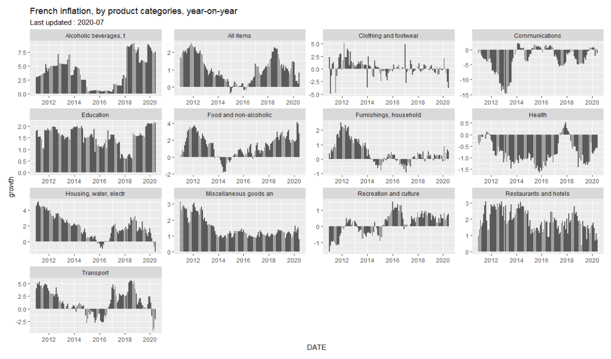
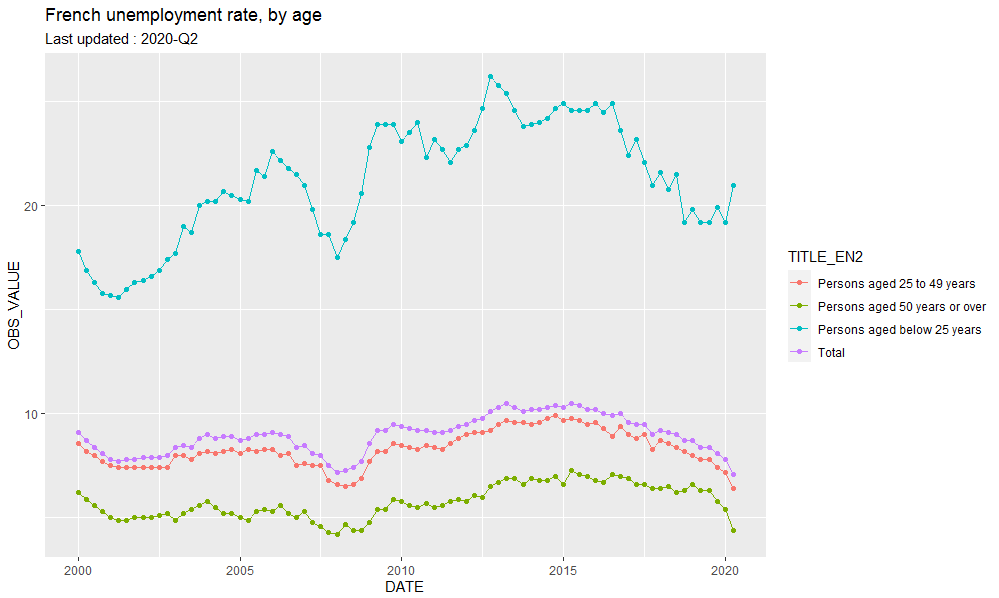
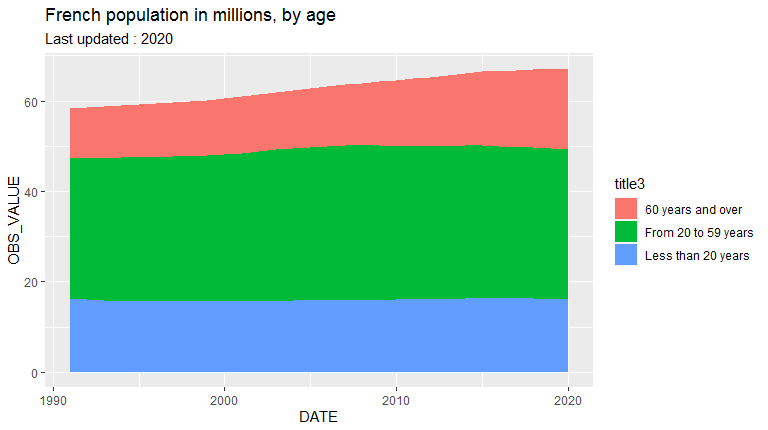

<!-- badges: start -->

[](https://cran.r-project.org/package=insee)
[](https://cran.r-project.org/package=insee)
[](https://cran.r-project.org/package=insee)

<!-- badges: end -->

## Overview

The insee package contains tools to easily download data and metadata from INSEE BDM database.
Using embedded SDMX queries, get the data of more than 140 000 INSEE series from BDM database (Banque de données macroéconomiques).

## Installation
```{r eval = FALSE}
# Get the development version from GitHub
# install.packages("devtools")
devtools::install_github("hadrilec2/insee")
```

# Library
```{r example, echo = FALSE}
library(tidyverse)
library(insee)
```

# get INSEE datasets list
```{r dataset list}
dataset = get_dataset_list()
```

# get INSEE series key (idbank) list
```{r idbank list}
idbank_list = get_idbank_list()
```

# select idbanks 
```{r select idbank}
idbank_list_selected = 
  idbank_list %>% 
  filter(nomflow == "ENQ-CONJ-ACT-IND") %>% 
  filter(dim12 == "A88-29") %>% 
  filter(dim8  == "CVS") %>% 
  filter(dim13 == "SOLDE_PROPORTION") %>% 
  filter(dim10 == "ECAI_TPE") 
```
  
# get idbank title
```{r get_title}
idbank_list_selected = 
  idbank_list_selected %>% 
  mutate(title = get_insee_title(idbank, lang = "fr")) 
```

# extract selected idbanks list
```{r selected idbank}
list_idbank = idbank_list_selected %>% pull(idbank)
```

# get selected idbanks data
```{r data}
data = get_insee_idbank(list_idbank)
```

# avoid proxy issues 
```{r proxy}
Sys.setenv(http_proxy = "my_proxy_server")
Sys.setenv(https_proxy = "my_proxy_server")
```

# Examples

## GDP growth rate 

```{r message=FALSE, warning=FALSE, eval=FALSE}
library(tidyverse)

idbank_list = get_idbank_list()

df_idbank_list_selected =
  idbank_list %>%
  filter(nomflow == "CNT-2014-PIB-EQB-RF") %>% # Gross domestic product balance
  filter(dim1 == "T") %>% #quarter
  filter(dim4 == "PIB") %>% #GDP
  filter(dim6 == "TAUX") %>% #rate
  filter(dim10 == "CVS-CJO") #SA-WDA, seasonally adjusted, working day adjusted

idbank = df_idbank_list_selected %>% pull(idbank)

data = get_insee_idbank(idbank)

#plot
ggplot(data, aes(x = DATE, y = OBS_VALUE)) +
  geom_col() +
  ggtitle("French GDP growth rate, quarter-on-quarter, sa-wda") +
  labs(subtitle = sprintf("Last updated : %s", data$TIME_PERIOD[1]))

```


## Inflation

```{r message = FALSE, warning=FALSE, eval = FALSE}
library(tidyverse)
library(lubridate)

idbank_list = get_idbank_list()

df_idbank_list_selected =
  idbank_list %>%
  filter(nomflow == "IPC-2015") %>% #Inflation dataset
  filter(dim1 == "M") %>% # monthly
  filter(str_detect(dim4, "^[0-9]{2}$")) %>% # coicop aggregation level
  filter(dim6 == "INDICE") %>% # index
  filter(dim7 == "ENSEMBLE") %>% # all kinds of household
  filter(dim8 == "FE") %>% # all France including overseas departements
  mutate(title = get_insee_title(idbank))

list_idbank = df_idbank_list_selected %>% pull(idbank)

data = get_insee_idbank(list_idbank, startPeriod = "2010-01")

n_sep = str_count(data$TITLE_FR[1], " - ") + 1

data_plot = data %>%
  separate(TITLE_EN, into = paste0("title", 1:n_sep),
           sep = " - ", remove = FALSE, fill = "right") %>%
  mutate(title6 = case_when(is.na(title6) ~ title5,
                            TRUE ~ as.character(title6))) %>%
  mutate(title6 = substr(title6, 1 , 22)) %>%
  mutate(month = month(DATE)) %>%
  arrange(DATE) %>%
  group_by(title6, month) %>%
  mutate(growth = 100 * (OBS_VALUE / dplyr::lag(OBS_VALUE) - 1))

ggplot(data_plot, aes(x = DATE, y = growth)) +
  geom_col() +
  facet_wrap(~title6, scales = "free") +
  ggtitle("French inflation, by product categories, year-on-year") +
  labs(subtitle = sprintf("Last updated : %s", data_plot$TIME_PERIOD[nrow(data_plot)])) 

```



## Unemployment rate

```{r unem}
library(tidyverse)

dataset_list = get_dataset_list()

idbank_list = get_idbank_list()

df_idbank_list_selected =
  idbank_list %>%
  filter(nomflow == "CHOMAGE-TRIM-NATIONAL") %>% #Unemployment dataset
  mutate(title = get_insee_title(idbank)) %>%
  filter(dim2 == "CTTXC") %>% #unemployment rate based on ILO standards
  filter(dim4 == "FE") %>%  # all France including overseas departements
  filter(dim5 == 0) # men and women

list_idbank = df_idbank_list_selected %>% pull(idbank)

data = get_insee_idbank(list_idbank, startPeriod = "2000-01")

n_sep = str_count(data$TITLE_FR[1], " - ") + 1

data_plot = data %>%
  separate(TITLE_EN, into = paste0("title", 1:n_sep),
           sep = " - ", remove = FALSE, fill = "right")

ggplot(data_plot, aes(x = DATE, y = OBS_VALUE, colour = title2)) +
  geom_line() +
  geom_point() +
  ggtitle("French unemployment rate, by age") +
  labs(subtitle = sprintf("Last updated : %s", data_plot$TIME_PERIOD[1]))

```



## Population

### Population by age

```{r population_age}
library(tidyverse)

dataset_list = get_dataset_list()

idbank_list = get_idbank_list()

df_idbank_list_selected =
  idbank_list %>%
  filter(nomflow == "POPULATION-STRUCTURE") %>% #population dataset
  mutate(title = get_insee_title(idbank)) %>%
  filter(dim2 == "POPULATION_1ER_JANVIER") %>% #population at the beginning of the year
  filter(dim5 == "FE") %>%  # all France including overseas departements
  filter(dim6 == 0) %>%  # men and women
  filter(dim7 %in% c("00-19", "20-59", "60-")) #age ranges

list_idbank = df_idbank_list_selected %>% pull(idbank)

data = get_insee_idbank(list_idbank)

n_sep = str_count(data$TITLE_FR[1], " - ") + 1

data_plot = data %>%
  separate(TITLE_EN, into = paste0("title", 1:n_sep),
           sep = " - ", remove = FALSE, fill = "right") %>%
  mutate(OBS_VALUE = OBS_VALUE / 10^6)

ggplot(data_plot, aes(x = DATE, y = OBS_VALUE, fill = title3)) +
  geom_area() +
  ggtitle("French population in millions, by age") +
  labs(subtitle = sprintf("Last updated : %s", data_plot$TIME_PERIOD[1]))

```



### Population by departement

```{r population_departement}

library(insee)
library(tidyverse)

library(raster)
library(rgdal)
library(broom)
library(viridis)

idbank_list = get_idbank_list()

dataset_list = get_dataset_list()

list_idbank = idbank_list %>%
  filter(nomflow == "TCRED-ESTIMATIONS-POPULATION") %>%
  filter(dim6 == "00-") %>% #all population
  filter(dim5 == 0) %>% #men and women
  filter(str_detect(dim4, "^D")) %>% #departement
  mutate(title = get_insee_title(idbank))

list_idbank_selected = list_idbank %>% pull(idbank)

# get population data by departement
pop = get_insee_idbank(list_idbank_selected)

#get departement limits
FranceMap <- raster::getData(name = "GADM", country = "FRA", level = 2)

# extract the population by departement in 2020
pop_plot = pop %>%
  group_by(TITLE_EN) %>%
  filter(DATE == "2020-01-01") %>%
  mutate(dptm = gsub("D", "", REF_AREA)) %>%
  filter(dptm %in% FranceMap@data$CC_2) %>%
  mutate(dptm = factor(dptm, levels = FranceMap@data$CC_2)) %>%
  arrange(dptm) %>%
  mutate(id = dptm)

vec_pop = pop_plot %>% pull(OBS_VALUE)

# add population data to the departement object map
FranceMap@data$pop = vec_pop

# extract the departement limits from the spatial object
FranceMap_tidy <- broom::tidy(FranceMap)

# mapping table
dptm_df = data.frame(dptm = FranceMap@data$CC_2,
                     dptm_name = FranceMap@data$NAME_2,
                     pop = FranceMap@data$pop,
                     id = rownames(FranceMap@data))

# add population data to departement dataframe
FranceMap_tidy_final =
  FranceMap_tidy %>%
  left_join(dptm_df, by = "id") %>%
  select(long, lat, pop, group, id)

ggplot() +
  geom_polygon(data = FranceMap_tidy_final,
               aes(fill = pop, x = long, y = lat, group = group) ,
               size = 0, alpha = 0.9) +
  coord_map() +
  theme_void() +
  scale_fill_viridis() +
  ggtitle("Distribution of the population on French territory in 2020")

```


# Support
Feel free to contact me with any question about this package using this [e-mail address](mailto:leclerc.hadrien@gmail.com?subject=[r-package][insee]).
